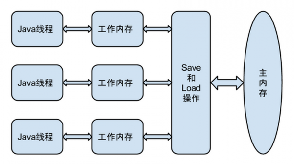

# 深入理解Java虚拟机 #

---

## Chapter 12 Java内存模型与线程 ##

### 12.1 概述 ###

>
>**TPS**(Transcations Per Second)，每秒事物处理数，是衡量一个服务器好坏的最重要指标之一。

### 12.2 硬件的效率与一致性 ###
>
>为了解决计算机数据存储速度与处理器计算速度之间相差好几个数量级的问题，现代计算机加入了**高速缓存（Cache）**作为内存与处理器之间的缓冲：将运算所需要的数据复制到缓存中，让运算能快速进行，当运算结束之后，再从缓存同步到内存中。
>
>新的问题：**缓存一致性（Cache Coherence）**。
>
>处理器、高速缓存、主内存之间的关系图：
>

### 12.3 Java内存模型 ###
>
>**Java内存模型（Java Memory Model, JMM）**
>
>JMM的主要目标是：定义程序中各个变量的访问规则，即在虚拟机中将变量存储到内存和从内存中取出变量这样的底层细节。

#### 12.3.1 主内存与工作内存 ####
>**主内存（Main Memory）**，JMM规定了所有的变量（包括了实例字段、静态字段和构成数组对象的元素，不包括局部变量和方法参数）都存储在主内存中（此处的主内存可以类比于Chapter12.2的主内存，但此处仅仅是虚拟机的一部分）
>
>**工作内存（Working Memory）**，每条线程独有，保存了该线程需要使用到的变量的主内存的副本拷贝，线程对变量的的所有操作都必须在工作内存中进行。
>
>线程、主内存、工作内存 三者的交互关系：
>

#### 12.3.2 内存间交互操作 ####
>关于内存与主内存之间具体的交互协议，JMM定义了以下八种操作来完成：
>
> - **lock(锁定)** ：作用于主内存的变量，把一个变量标识为一条线程独占的状态。
> 
> - **unlock(解锁)**：作用于主内存的变量，把处于锁定状态的变量释放出来，释放后的变量才能被其他线程锁定。
> 
> - **read(读取)**：作用于主内存的变量，把一个变量的值从主内存传输到线程的工作内存中，以便随后的**load**动作使用。
> 
> - **load(载入)**：作用于工作内存的变量，把**read**操作从主内存得到的变量值放入工作内存的变量副本中。
> 
> - **use(使用)**：作用于工作内存的变量，把工作内存中的一个变量的值传递给执行引擎，每当虚拟机遇到一个需要使用到的变量的值的字节码指令时，会使用到此操作。
> 
> - **assign(赋值)**：作用于工作内存的变量，把一个从执行引擎接收到的值赋值给工作内存的变量，每当虚拟机遇到一个变量赋值的字节码指令时，会使用到此操作。
> 
> - **store(存储)**：作用于工作内存的变量，把工作内存中一个变量的值传送到主内存中，以便以后的**write**操作使用。
> 
> - **write(写入)**：作用于主内存的变量，把**store**操作从工作内存中得到的变量的值放入主内存的变量中。
> 
> 