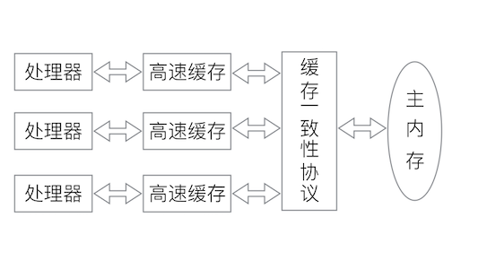

# 深入理解Java虚拟机 #

---

## Chapter 12 Java内存模型与线程 ##

### 12.1 概述 ###

>
>**TPS**(Transcations Per Second)，每秒事物处理数，是衡量一个服务器好坏的最重要指标之一。

### 12.2 硬件的效率与一致性 ###
>
>为了解决计算机数据存储速度与处理器计算速度之间相差好几个数量级的问题，现代计算机加入了**高速缓存（Cache）**作为内存与处理器之间的缓冲：将运算所需要的数据复制到缓存中，让运算能快速进行，当运算结束之后，再从缓存同步到内存中。
>
>新的问题：**缓存一致性（Cache Coherence）**。
>
>处理器、高速缓存、主内存之间的关系图：
>

### 12.3 Java内存模型 ###
>
>