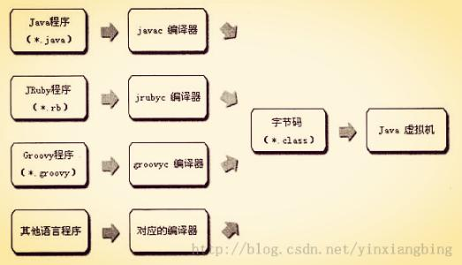
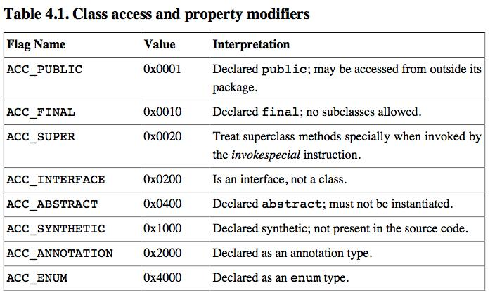

# 深入理解Java虚拟机 #

---

## Chapter 6 类文件结构 ##

### 6.1 概述 ###

> 现在越来越多的程序语言选择了与操作系统无关和机器指令无关的、平台中立的格式作为程序编译后的存储格式。

### 6.2 无关性的基石 ###
> 

### 6.3 Class类文件的结构 ###
> Class文件是一组以8位字节为基础单位的二进制流，各个数据项目严格按照顺序紧凑地排列在Class文件中，中间没有添加任何分隔符。当遇到需要占用8位字节以上空间的数据项时，则会按照高位在前的方式分割成若干个8位字节进行存储。
> 
> 按照Java虚拟机规范，Class文件格式采用一种类似于C语言结构体的伪结构来存储，这种结构中只有两种数据类型：无符号数和表。
> 
> - **无符号数**属于基本的数据类型，以u1、u2、u4、u8来分别代表1个字节、2个字节、4个字节、和8个字节的无符号数，无符号数可以用来描述数字、索引引用、数量值、或者按照UTF-8编码构成字符串值。
> - **表**是由多个无符号数或其他表作为数据项构成的复合数据类型，所有的表都习惯性地以```"_info"```结尾。表用于描述有层次关系的复合数据结构的数据，整个Class文件本质上就是一张表，它由如下所示的数据项构成：
> 
> 
> 无论是无符号数还是表，当需要描述同一类型单数量不定的多个数据时，经常会使用一个前置的容量计数器加若干个连续的数据项的形式，这时候称这一系列连续的某一类型的数据位某一类型的集合。

#### 6.3.1 魔数与Class文件的版本 ####
> 每个Class文件的头4个字节称为魔数（Magic Number），它的唯一作用时用语确定这个文件是否作为一个能被虚拟机接受的Class文件。Class文件的魔数值是```0xCAFEBABE```（咖啡宝贝？）。
> 
> 紧挨着魔数的4个字节存储的是Class文件的版本号：第5和6个字节是次版本号（Minor Version），第7和8个字节是主版本号（Major Version）。Java的版本号是从45开始的，以后每个大版本发布后，主版本号向上加1，高版本的JDK能向下兼容以前版本的Class文件，但不能运行以后版本的Class文件，即使文件格式并未发生变化。

#### 6.3.2 常量池 ####
> 紧接着主次版本号之后的是常量池入口，它是Class文件中与其它项目关联最紧密的数据类型，也是占用Class文件空间最大的数据项目之一，同时还是Class文件中第一个出现的表类型数据项目。
> 
> 常量池中主要存放两大类常量：字面量（Literal）和符号引用（Symbolic Reference）。字面量比较接近Java语言的常量概念，如文本字符串、被声明为final的常量值等。而符号引用则属于编译原理方面的概念，包括了下面三类常量：
> 
> - 类和接口的全限定名（Fully Quaified Name）
> - 字段的名称和描述
> - 方法的名称和描述符

#### 6.3.3 访问标志 ####
> **访问标志（access_flag）**：用于识别一些类或接口层次的访问信息，包括：这个Class是类还是接口，是否定义为public类型，是否定义为abstract类型，如果是类的话，是否被声明为final，等等。
> 
> 具体的标志位及含义，见下表：
> 
> 

#### 6.3.4 类索引、父类索引、接口索引集合 ####
> 类索引（this_class）和父类索引（super_class）都是一个u2类型的数据，而接口索引集合是一个u2类型的数据集合，class文件由这三个数据来确定这个类的继承关系。

#### 6.3.5 字段表集合 ####
> **字段表（field_info）**：用于描述类或者接口的声明的变量，不包括方法的内部声明变量。
> 
> Java中一个字段（field）可以包含的信息包括：字段的作用域（public、private、protected）、类级别还是实例级别（static）、可变性（final）、并发可见性（volatile是否强制从主内存读写）、可否序列化（transient）、字段数据类型（基本类型、对象、数组）、名称。

#### 6.3.6 方法表集合 ####
> 方法表的结构如同 【Chapter 6.3.5 字段表集合】一样，一次包括了，访问标识（access_flag）、名称索引（name_index）、描述符索引（descriptor_index）、属性表集合（attributes）。

#### 6.3.7 属性表集合 ####
> **属性表集合（attribute_info）**：用于描述某些场景（Class文件、字段表、方法表）的专有信息。

##### 6.3.7.1 Code属性 #####
> Java程序方法体里面的代码经过javac编译器处理之后，最终会变成字节码指令存储在Code属性内。

##### 6.3.7.2 Exceptions属性 #####
> 列举出方法体中可能抛出的受查异常（checked exception），也就是方法描述时在throws关键字后面的异常。

##### 6.3.7.3 LineNumberTable属性 #####
> 用于描述Java字节码行号与源代码行号之间的对应关系（字节码的偏移量）。

##### 6.3.7.4 LocalVariableTable属性 #####
> 用于描述栈帧中局部变量表中的变量和Java源代码中定义的变量之间的关系。

##### 6.3.7.5 SourceFile属性 #####
> 用于记录生成这个Class文件的源码文件的名称。

##### 6.3.7.6 ConstantValue属性 #####
> 通知虚拟机自动为静态变量赋值。

##### 6.3.7.7 InnerClasses属性 #####
> 用于记录内部类与宿主之间的关联。

> 
> 
> > 