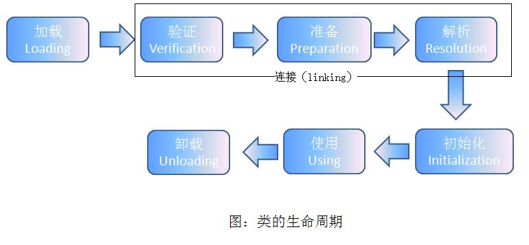

# 深入理解Java虚拟机 #

---

## Chapter 7 虚拟机类的加载机制 ##

### 7.1 概述 ###

> 虚拟机把描述类的数据从Class文件加载到内存，并对数据进行校验、转换解析和初始化，最终形成可以被虚拟机直接使用的Java类型，这就是**虚拟机的类的加载机制**。

### 7.2 类的加载时机 ###
> 
> 
> - **加载（Loading）**：按照虚拟机规范，**有且只有**以下四种情况下必须立即对类进行“初始化”：
>  - 遇到new、getstatic、putstatic或invokestatic这4条字节码指令时，如果类没有初始化，则需要先出发其初始化。生成这4条指令的典型场景是：使用 ```new``` 关键字实例化对象的时候、读取或设置一个类的静态字段的时候（被final修饰、已在编译期把结果放入常量池的静态字段除外）、以及调用一个类的静态方法的时候
>  - 使用 ```java.lang.reflect``` 包的方法对类进行反射调用的时候
>  - 当初始化一个类时，如果发现它的父类还没有进行初始化，则需要先触发其父类进行初始化
>  - 当虚拟机启动时，用户需要指定一个要执行的主类（包含main方法的类），虚拟机会先初始化这个类

### 7.3 类的加载过程 ###
> 加载、验证、准备、解析、初始化
#### 7.3.1 加载 ###
> 