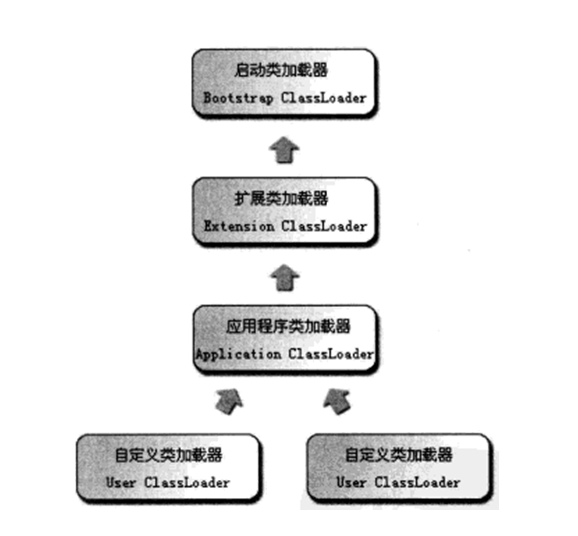

# 深入理解Java虚拟机 #

---

## Chapter 7 虚拟机类的加载机制 ##

### 7.1 概述 ###

> 虚拟机把描述类的数据从Class文件加载到内存，并对数据进行校验、转换解析和初始化，最终形成可以被虚拟机直接使用的Java类型，这就是**虚拟机的类的加载机制**。

### 7.2 类的加载时机 ###
> 
> 
> - **加载（Loading）**：按照虚拟机规范，**有且只有**以下四种情况下必须立即对类进行“初始化”：
>  - 遇到new、getstatic、putstatic或invokestatic这4条字节码指令时，如果类没有初始化，则需要先出发其初始化。生成这4条指令的典型场景是：使用 ```new``` 关键字实例化对象的时候、读取或设置一个类的静态字段的时候（被final修饰、已在编译期把结果放入常量池的静态字段除外）、以及调用一个类的静态方法的时候
>  - 使用 ```java.lang.reflect``` 包的方法对类进行反射调用的时候
>  - 当初始化一个类时，如果发现它的父类还没有进行初始化，则需要先触发其父类进行初始化
>  - 当虚拟机启动时，用户需要指定一个要执行的主类（包含main方法的类），虚拟机会先初始化这个类

### 7.3 类的加载过程 ###
> 加载、验证、准备、解析、初始化
#### 7.3.1 加载 ###
> **加载（Loading）**阶段，虚拟机需要完成以下三件事：

> - 通过一个类的全限定名来获取定义这个类对应的二进制字节流
> - 将这个类的二进制字节流所代表的静态存储结构转换为方法区的运行时数据结构
> - 在Java堆中生成一个代表这个类的 ```java.lang.Class``` 对象，作为方法区这些数据的访问入口。

### 7.3.2 验证 ###
> 验证是虚拟机对自身保护的一项重要工作。
> 
> 大致完成以下四个阶段的检验过程：
> 
> - **文件格式验证**，验证字节流是否符合Class文件格式规范，并且能被当前版本的虚拟机处理。
> - **元数据验证**，对字节码描述的信息进行语义分析，以保证其描述的信息符合Java语言规范要求。
> - **字节码验证**，主要工作是进行数据流和控制流分析，保证被校验类的方法不会危害到虚拟机的安全。
> - **符号引用验证**，可以看作是对类自身以外（常量池中的各种符号引用）的信息进行匹配性的校验。

### 7.3.3 准备 ###
> 准备阶段是正式为类变量分配内存并设置类变量初始值的阶段，这些内存都将在方法区中进行分配。

### 7.3.4 解析 ###
> 是虚拟机将常量池中的符号引用替换为直接引用的过程。
>  
> 解析动作主要针对类或接口、字段、类方法、接口方法四类符号引用分别进行。

### 7.3.5 初始化 ###
> 真正开始执行类中定义的Java程序代码（或者说是字节码）。

## 7.4 类加载器 ##
> 类加载过程中的*“通过一个类的全限定名来获取描述这个类的二进制字节流”*这个动作是放在Java虚拟机的外部来实现的，以便于让应用程序自己来决定如何去获取所需要的类，实现这个动作的代码模块被称为**“类加载器”**。

### 7.4.1 类和类加载器 ###
> **类加载器**虽然只用于实现类的加载动作，但是它的作用却远远不限于此，比较两个类是否“相等”，不仅仅要确认这两个类是否来源于同一个class文件，还需要加载这两个类的类加载器相同。
### 7.4.2 双亲委派模型 ###
> 站在虚拟机的角度，只存在两种类加载器：
> 
> - **启动类加载器（Bootstrap ClassLoader）**，使用C++实现，是虚拟机的一部分
> - 其他类加载器，由Java语言实现，独立于虚拟机之外的，全部继承自抽象类 ```java.lang.ClassLoader```
> 
> 从开发人员的角度，类加载器可以划分得更细致一些：
> 
- **启动类加载器（Bootstrap ClassLoader）**：负责将存放在 ```<JAVA_HOME>\lib``` 目录中的，或者被 ```-Xbootclasspath``` 参数所指定的路径中的，并且是虚拟机识别的类库加载到虚拟机内存中。
- **扩展类加载器（Extension ClassLoader）**：负责加载 ```<JAVA_HOME>\lib\ext``` 目录下的，或者被 ```java.ext.dirs``` 系统变量所指定的路径中的所有类库，开发者可以直接使用扩展类加载器。
- **应用程序类加载器（Application ClassLoader）**：负责加载用户类路径（ClassPath）上所指定的类库，一般情况下这个就是程序中默认的类加载器。

> 
> 以上加载器互相配合来加载我们自己的应用程序，如果有必要，我们还可以加入自己定义的加载器。这些加载器之间的关系一般如下图示：
> 
> 
>
>类加载器的**双亲委派模型（Parent Delegation Model）**：要求除了顶层的启动类加载器外，其余的类加载器都必须有自己的父类加载器。（⚠️，这里类加载器之间的父子关系一般不会以继承（Inheritance）来实现，而是使用组合（Composition）来复用父加载器的代码）。这种模型被广泛使用于几乎所有的Java程序中，但是它并不是一个强制性的约束，只是Java设计者推荐给开发者使用的一种类加载器实现方式。
>
>*双亲委派模型的具体工作过程是：如果一个类收到了加载请求，它首先不会尝试自己去加载这个类，而是把这个请求委派给他的父类加载器去完成，每一层次的加载类都是如此，因此所有的加载请求都会传递给最顶层的启动类加载器中，只有当父加载器反馈自己无法完成这个加载请求（它的搜索范围内找不到需要加载的类）时，子类才会尝试自己去加载。*
>
>好处：java类随着它的类加载器一起具备了一种带有优先层级的层次关系，保证了Java程序的稳定运行。

### 7.4.3 破坏双亲委派模型 ###
> OSGi


