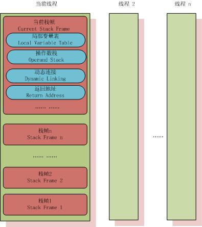

# 深入理解Java虚拟机 #

---

## Chapter 8 虚拟机字节码执行引擎 ##

### 8.1 概述 ###

> **执行引擎**是Java虚拟机最核心的组成之一。

### 8.2 运行时栈帧结构 ###
> **栈帧（Stack Frame）**是用于支持方法调用和方法执行的数据结构。它是虚拟机运行时数据区中的虚拟机栈的栈元素，存储了方法的局部变量表、操作数栈、动态链接和方法返回地址等信息。每一个方法从调用开始到执行完成的过程，就对应着一个栈帧在虚拟机栈里面从入栈道出栈的过程。
> 
> 栈帧的概念结构图：
> 
> 
> 