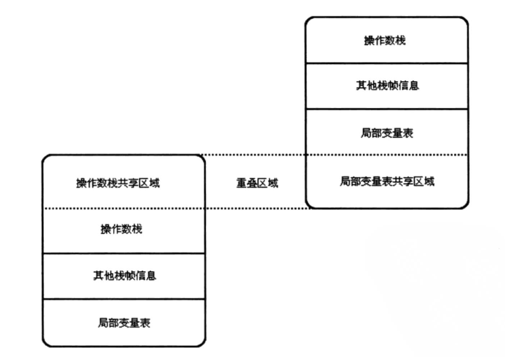

# 深入理解Java虚拟机 #

---

## Chapter 8 虚拟机字节码执行引擎 ##

### 8.1 概述 ###

> **执行引擎**是Java虚拟机最核心的组成之一。

### 8.2 运行时栈帧结构 ###
> **栈帧（Stack Frame）**是用于支持方法调用和方法执行的数据结构。它是虚拟机运行时数据区中的虚拟机栈的栈元素，存储了方法的局部变量表、操作数栈、动态链接和方法返回地址等信息。每一个方法从调用开始到执行完成的过程，就对应着一个栈帧在虚拟机栈里面从入栈道出栈的过程。
> 
> 栈帧的概念结构图：
> 

#### 8.2.1 局部变量表 ####
> 局部变量表是一组变量值存储空间，用于存放方法的参数和方法类定义的局部变量。
> 
> 它是以变量槽（Variable Slot）为最小单位，每一个Slot（32位）都应该能放一个 boolean 、byte 、char 、float 、 reference 、 short 、 int 或 returnAddress 类型数据。而至于 long 、double 两种数据则被规定为是64位数据（连续两个32位）。
> *reference类型数据可能食32位，也可能是64位数据*

#### 8.2.2 操作数栈 ####
>也被称之为操作栈，是一个先进先出（FIFO）的栈。 
> 
> 操作数栈的最大深度也在编译的时候就被写入到code属性的 ```max_stacks``` 数据项之中。
> 
> 在概念模型中，两个栈帧相互之间是完全独立的，但是大多数虚拟机会做一些优化处理，令两个栈帧出现一部分重叠，这样在方法调用时就可以公用一部分数据，无须进行额外的参数复制传递的操作。如下图示：
> 
> 

#### 8.2.3 动态连接 ####
> 每个栈帧都包含一个运行时常量池中指向该栈帧所属方法的引用，这是为了支持方法调用过程中的**动态连接**。

#### 8.2.4 方法返回地址 ####
> 当一个方法被执行时，有两种方式推出这个方法：
> 
> - 正常完成出口（Normal Method Invocation Completion）
> - 异常完成出口（Abrupt Method Invocation Completion）

#### 8.2.5 附加信息 ###
> 虚拟机规范允许具体的虚拟机实现增加一些规范里没有描述的信息到栈帧之中。

### 8.3 方法调用 ###
> 确定被调用方法的版本（即调用哪一个方法）。

#### 8.3.1 方法解析 ####
> 调用目标在程序写好、编译器进行编译时就确定下来，这种方法的调用称之为**解析（Resolution）**。
> 
> 简单总结就是：**编译器可知，运行期不可变**。
> 
> 在Java中符合这种要求的方法主要有：静态方法和私有方法

#### 8.3.2 分派 ####
> 

##### 1）、 静态分派 #####
>
> ```Human man = new Man();```
> 
> **静态类型**：```Human```
> 
> **实际类型**：```Man```
> 
> 在编译阶段，Javac编译器就根据参数的静态类型决定使用哪个重载版本。

##### 2）、	动态分派 #####
> 
> 在运行期间根据实际类型确定方法执行版本的分配过程称为动态分派。
> 
> 